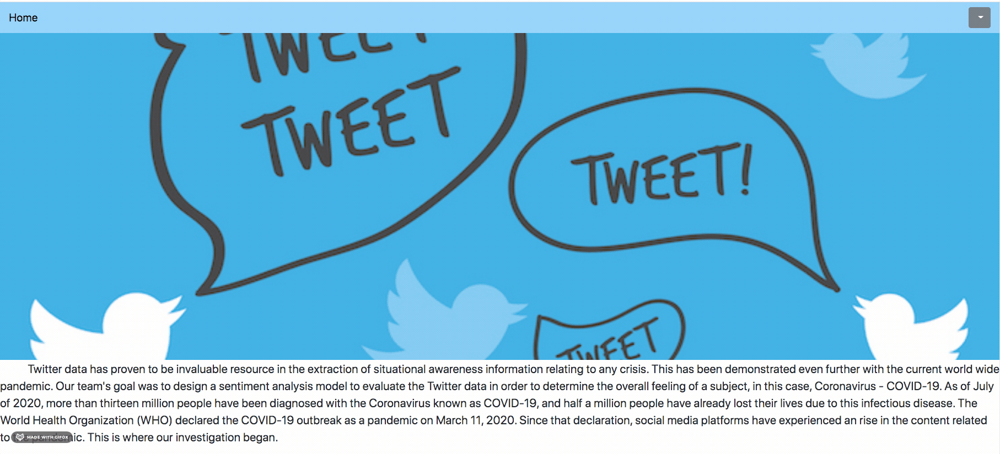
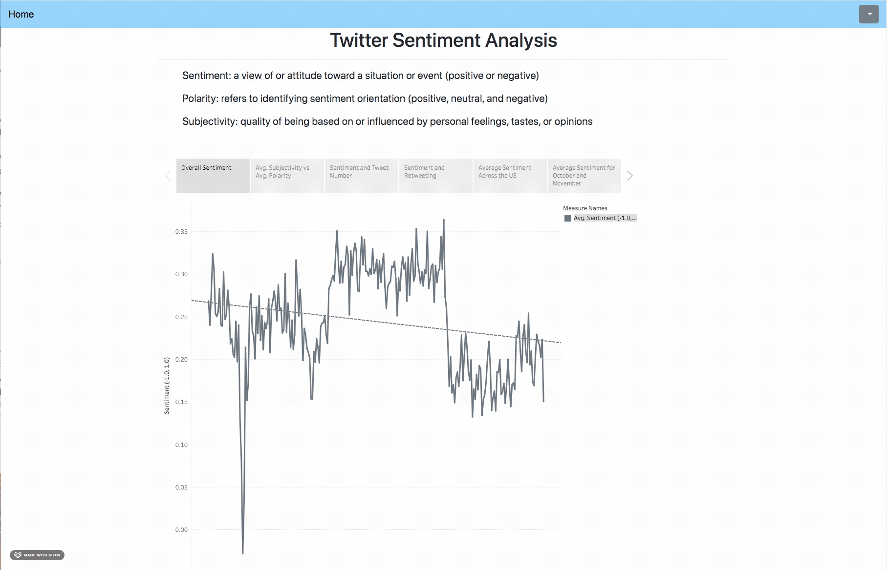
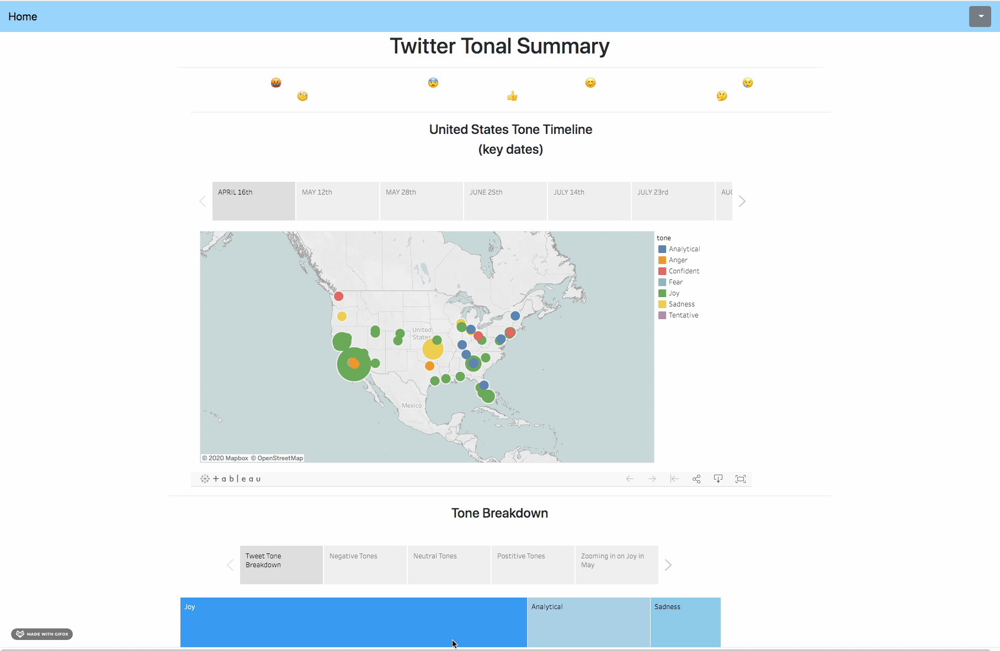

# COVID-19-Sentiment-Analysis

# COVID-19-Sentiment-Analysis

OUTLINE: 
The goal of this project was to create a machine learning model that was able to determine sentiment from Tweets shared on Twitter. We created a model that was able to determine a tweets sentiment, subjectivity and polarity. We also integrated the use of IMBWatson's Tone Analyzer to take a deeper dive into our data to determine the tone of the tweets (anger, sadness, joy, tenative, confidence, fear and analytical). 

To view our results please visit:

https://twitterpated-by-coronavirus.herokuapp.com/

Functionality and Backend:
An overall dashboard displaying visuals built in Tableau. 
Each page in the app has a navbar for navigating the application easily.
Flask is used to structure between the backend and the frontend website.
MongoDB is used to house the results from Twitter's API. 

Below is a quick look at the app:

